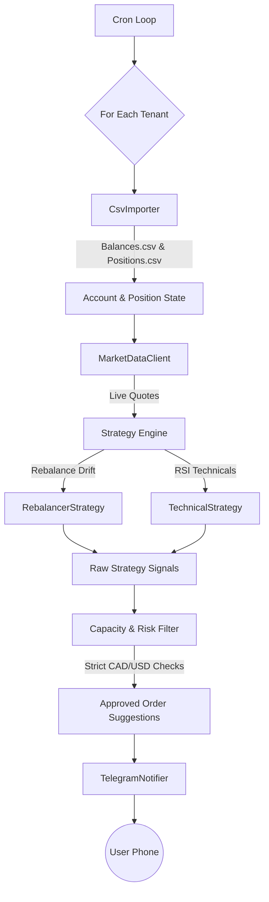

# Engineering Design: Tradelah MVP (Multi-Tenant CSV Mode)

**Author:** Antigravity  
**Status:** Implemented (v0.2)  
**Date:** 2026-06-21  

---

## 1. Context and Scope
Tradelah is a personal trading and rebalancing advisor daemon. The initial iterations of Tradelah were tightly coupled to the Questrade API for single-user live polling. However, to eliminate external API dependency overhead and immediately support multiple users (e.g., the primary user and their spouse) without complex OAuth management, Tradelah has pivoted to a **Multi-Tenant Dual-CSV Mode** for its MVP. 

This document outlines the technical design of the Tradelah MVP, focusing on its multi-tenant ingestion pipeline, strict CAD/USD currency isolation, decoupled strategy evaluation engine, and Telegram-based notification layer.

## 2. Goals & Non-Goals

### 2.1 Goals
- **Multi-Tenant Support:** Seamlessly process independent portfolios (configured via `config.json` and respective CSV files) without data cross-contamination.
- **Offline Data Ingestion:** Parse standard Questrade export formats (`Balances.csv` and `Positions.csv`) securely from the local filesystem.
- **Strict Currency Isolation:** Silo `CAD` and `USD` purchasing power to ensure recommendations never force unintended Foreign Exchange (FX) conversion costs.
- **Tax-Optimized Routing:** Recommend purchases in the optimal registered account type (e.g., RRSP for US-dividend-paying assets to avoid withholding tax, TFSA for Canadian equities).
- **Stateless Operation:** The evaluation loop must remain idempotent. State is inferred entirely from the CSVs and real-time market quotes.

### 2.2 Non-Goals
- **Automated Trade Execution:** Tradelah only *advises* via Telegram notifications. It will not execute trades.
- **Live Account Syncing:** The live Questrade API integration is intentionally dormant for this MVP phase. Users must manually supply the CSV exports.
- **Real-Time Intraday Signals:** The rebalancer relies on static CSV states which do not update automatically intraday.

---

## 3. Architecture Overview

Tradelah follows a clean, linear, push-based pipeline architecture that executes periodically per tenant.



---

## 4. Detailed Design

### 4.1 Data Models & Currency Isolation
To strictly enforce currency separation and prevent accidental FX conversions, the base `Account` model natively splits purchasing power. 

```typescript
export interface Account {
  type: 'TFSA' | 'RRSP' | 'MARGIN';
  accountId: string;
  cashCAD: number;
  cashUSD: number;
  buyingPowerCAD: number;
  buyingPowerUSD: number;
  positions: Position[]; // Each position has a strict 'CAD' | 'USD' currency flag
}
```

### 4.2 Multi-Tenant Configuration (`src/config/index.ts`)
Tenants are dynamically loaded from `tenants/*/config.json`. Each config specifies the tenant's individual Telegram Chat ID, portfolio target allocations, and paths to their specific Questrade CSV exports. This removes hardcoded constants and enables horizontal scaling of users.

### 4.3 Ingestion Pipeline (`integrations/csvImporter.ts`)
The `CsvImporter` uses a **Two-Pass parsing strategy**:
1. **Pass 1 (`Balances.csv`):** Parses the account summary file to establish the core `Account` objects, mapping `Cash in CAD` and `Cash in USD` to their respective buckets via the `Account Number` primary key.
2. **Pass 2 (`Positions.csv`):** Parses the granular holdings file. Maps each holding to its parent account, explicitly infers currency (via `.TO` / `.V` suffixes or direct CSV metadata), and appends it to the `positions` array.

### 4.4 Strategy Engine (`strategy/`)
The engine is split into independent sub-modules that emit uniform `StrategySignal` objects:
- **`RebalancerStrategy`**: Aggregates total portfolio value across all accounts. To do this accurately, it temporarily normalizes USD assets and cash to CAD using a static FX rate (MVP). It compares the current asset weight against the target weight defined in `config.json`. Drifts exceeding the threshold emit `BUY` or `SELL` signals.
- **`TechnicalStrategy`**: Evaluates active market quotes against historical data (mocked for MVP) to detect oversold/overbought conditions (e.g., RSI < 30).

### 4.5 Capacity & Risk Filter (`risk/capacity.ts`)
This is the core safeguard mechanism. When a raw `StrategySignal` (e.g., `BUY 100 shares of MSFT`) is received:
1. **Routing:** It determines the optimal account. USD assets default to `RRSP`. CAD assets default to `TFSA`.
2. **Currency Verification:** It checks if the routed account has sufficient funds **in the specific native currency** (`cashUSD` for MSFT). If the account only has `cashCAD`, the signal is rejected.
3. **Buffer Enforcement:** It calculates a cash buffer (e.g., 5% of total portfolio) to ensure the account is not completely drained.
4. **Sizing:** The requested quantity is throttled to ensure the post-trade portfolio weight does not exceed the `maxPositionSizePercent`.

### 4.6 Notification Layer (`integrations/telegram.ts`)
Approved `OrderSuggestion` objects are formatted into rich Markdown V2 strings and dispatched to the Telegram Bot API. The formatting explicitly affixes `CAD` or `USD` to all monetary values to give the user absolute clarity on which currency bucket the trade will impact.

---

## 5. Alternatives Considered

### 5.1 Plaid / Live Questrade API
* **Approach:** Use OAuth2 to automatically pull live balances from Questrade.
* **Why Rejected (for MVP):** Implementing robust token rotation, managing secure storage for multiple spouses/tenants, and handling rate limits introduced significant complexity. Relying on local CSVs allows the core engine to be built, tested, and validated with zero API surface risk. The Questrade API client logic has been preserved in `integrations/questrade.ts` and will be re-enabled in V2.

### 5.2 Unified Purchasing Power (Implicit FX Conversion)
* **Approach:** Allow the `CapacityFilter` to use CAD cash to buy USD stocks, assuming Questrade will auto-convert the currency.
* **Why Rejected:** Questrade charges exorbitant markup fees (usually ~1.5% - 2%) on auto-conversions. The user explicitly required strict separation so they know exactly how much native currency they have available to invest without incurring fees.

---

## 6. Security & Privacy
- **Stateless Execution:** The application does not upload portfolio data to any remote server (except price tickers to public finance APIs).
- **Environment Secrets:** Telegram Bot tokens are stored strictly in `.env` and excluded from source control. 
- **Offline Data:** Because the `Balances.csv` and `Positions.csv` files contain sensitive financial data, they must be stored locally in the `tenants/` directory and are heavily protected by the repository's `.gitignore` rules.

---

## 7. Testing & Verification
The architecture is heavily decoupled to allow dependency injection testing.
- **Unit Tests:** `csvImporter.test.ts` validates the two-pass algorithm and currency mappings. `capacity.test.ts` injects mock accounts to verify strict CAD/USD boundaries and tax routing logic.
- **Integration Tests:** `multiTenant.test.ts` isolates two tenant configurations in parallel, ensuring Tenant A's massive USD cash balance does not authorize Tenant B's USD purchase.
- **End-to-End Tests:** `flow.test.ts` mocks the complete lifecycle from CSV ingestion to mocked Telegram dispatch.
