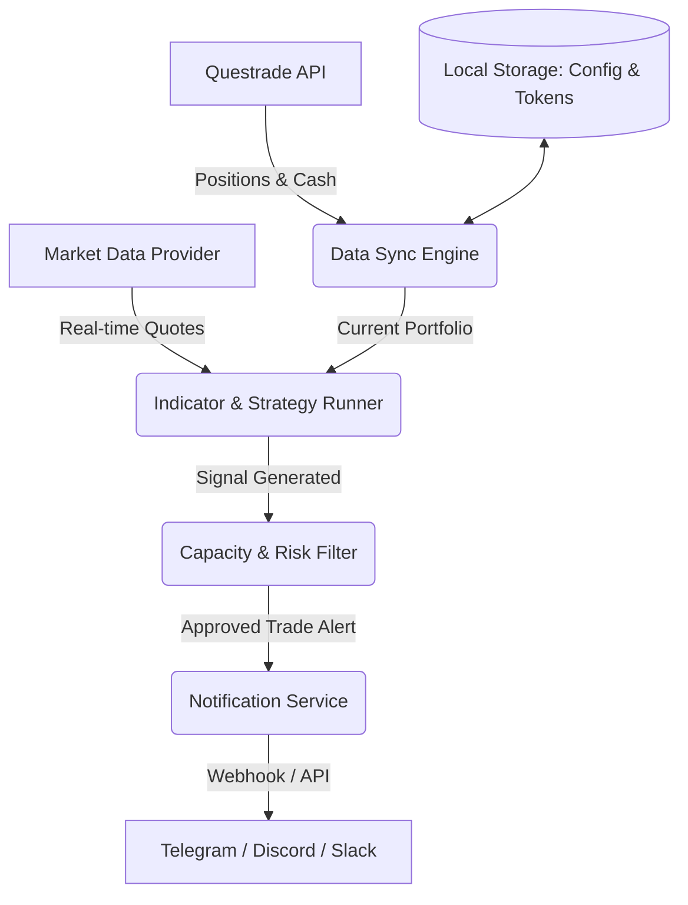

# Product Requirements Document (PRD) - Personal Trade Advisor MVP

This PRD outlines the requirements and design for an MVP (Minimum Viable Product) of a personal trading investment advice application (**Tradelah**). The app is designed to monitor your personal Questrade portfolios (RRSP and TFSA), analyze market indicators against your custom investment strategy and risk tolerance, and notify you in real-time via a flexible messaging platform before indicators are missed.

---

## 1. Objectives & Use Cases
*   **Real-time Alerts**: Notify the user of buy/sell indicators for stocks/ETFs in their watchlist or current holdings.
*   **Portfolio Awareness**: Understand current holdings, cash balances, and account types (specifically Questrade TFSA and RRSP) to tailor advice. For example, avoiding wash-sale suggestions in taxable accounts (if any) or factoring in registered account contribution rules.
*   **Capacity & Risk Management**: Ensure trade recommendations do not exceed pre-configured risk parameters, allocation caps, or available buying power (capacity) in the respective account.
*   **Convenient Notifications**: Deliver alerts directly to a daily-use messaging client (e.g., Telegram, Discord, or Slack) with rich action items.

---

## 2. Core Features (MVP)

### A. Questrade API Integration
Questrade exposes a REST API for accessing account details. The MVP must support:
*   **Authentication**: Securely handle Questrade's OAuth2 flow. This requires using a manually retrieved developer refresh token to boot up the system, and subsequently auto-refreshing the token and saving it locally.
*   **Account Discovery**: Automatically identify and pull details for **RRSP** and **TFSA** accounts.
*   **Position & Balance Retrieval**: Periodically fetch:
    *   Open positions (quantities, average entry price, market value).
    *   Cash balance (CAD and USD) to evaluate buying capacity.
    *   Execution history (to verify past trades).

### B. Strategy & Signal Engine
A pluggable engine where strategies can be configured.
*   **Data Feeds**: Integrate a reliable, cost-effective market data feed (e.g., Questrade API streaming/polling, or free tier Yahoo Finance/Alpha Vantage API) for real-time or near-real-time ticker prices.
*   **Technical/Fundamental Indicators**: Run lightweight checks based on your configured strategy (e.g., Simple Moving Averages, RSI thresholds, or Portfolio Rebalancing targets).
*   **Rebalancing Rules**: Trigger rebalancing alerts if an asset allocation drifts past a threshold (e.g., target 60/40 Equity/Bond splits drift by more than 5%).

### C. Capacity & Risk Assessment
Before any trade recommendation is dispatched, a compliance check is run:
*   **Buying Capacity**: Does the account (TFSA/RRSP) have enough cash/buying power for the proposed trade?
*   **Position Sizing**: Limit the maximum size of any single trade to a configurable percentage of the total portfolio value (e.g., max 5% per position).
*   **Account Restrictions**: Avoid proposing short selling or options trading in TFSA/RRSP accounts where they are restricted or carry high tax/margin risks.

### D. Flexible Notification Service
The system must support a modular notification interface.
*   **Primary Channel**: **Telegram** or **Discord** webhook integration (easy to setup, supports rich markdown, buttons, and instant push notifications).
*   **Payload Detail**: The message must be structured and easy to read at a glance:
    *   **Action**: `🚨 BUY` or `⚠️ SELL`
    *   **Asset**: Ticker (e.g., `VFV.TO`, `MSFT`)
    *   **Account**: `TFSA` or `RRSP`
    *   **Suggested Price & Quantity**: Based on strategy and buying power.
    *   **Impact**: Predicted post-trade allocation (e.g., "This increases VFV allocation to 18.2%").
    *   **Links**: A quick link to Questrade's login/trade screen or the chart.

---

## 3. Architecture & Data Flow

Below is the conceptual architecture of the MVP:

### Data Storage Requirements (Local)
Since this is a personal app, a simple, lightweight database or file-based storage is preferred to minimize cloud hosting costs:
*   **SQLite** or JSON files for storing credentials, configurations, and watchlists.
*   **Secure Environment Variables (`.env`)** for secrets (Questrade Consumer Key, Telegram Bot Tokens, Webhooks).

---

## 4. Non-Functional Requirements

### A. Security & Privacy
*   **Local Execution**: The app should run locally on your machine (e.g., a background service, cron job, or lightweight Docker container) or on a private micro-instance (like a Raspberry Pi or a free-tier VPS) to keep financial data completely private.
*   **Secret Management**: Under no circumstances should Questrade API access tokens, refresh tokens, or account credentials be checked into version control.
*   **OAuth Lifecycle**: Implement a robust mechanism to store the refreshed Questrade token securely, as Questrade refresh tokens expire if not updated within a short window.

### B. Reliability & Frequency
*   **Polling Frequency**: Run signal evaluations every 15-30 minutes during market hours to prevent hitting API rate limits while catching standard hourly/daily indicator moves.
*   **Error Recovery**: Automatically retry failed Questrade API calls with exponential backoff and send an alert if credentials expire and require manual re-authorization.

---

## 5. Scope & Out of Scope for MVP
1.  Questrade API auth and data fetching.
2.  Configuration file for portfolio targets, watchlist, and strategy rules.
3.  Simple technical indicator alerts (e.g., price crossing SMA, RSI levels, or drift from target asset allocation).
4.  Instant alerts via Telegram or Discord with pre-filled trade amounts.
5.  Interactive command line interface (CLI) or a lightweight local dashboard for manual runs and settings adjustments.

### Out of Scope (Future Phases)
1.  **Direct Trade Execution**: Making actual trades on Questrade via API (requires additional write permissions, safety guards, and introduces high financial risk).
2.  **Multi-User Support**: This app is strictly single-tenant for your personal accounts.
3.  **Complex Derivatives**: Options strategies, margin trading, and short-selling indicators.

---

## 6. MVP Release Timeline & Milestones
1.  **Phase 1: Questrade Connector**: Set up developer keys, implement OAuth token rotation, and successfully print TFSA/RRSP positions and cash balances to the console.
2.  **Phase 2: Market Data & Strategy Logic**: Integrate Yahoo Finance API, implement a basic RSI or moving average crossover strategy on a watchlist of 5 tickers.
3.  **Phase 3: Capacity & Filter Engine**: Calculate maximum purchase volume based on current TFSA/RRSP cash, and implement maximum trade limits.
4.  **Phase 4: Messaging Integration**: Setup Telegram Bot/Webhook, format alerts, and run tests.
5.  **Phase 5: Deploy & Monitor**: Set up a daily cron/daemon to run on a local machine or server.
